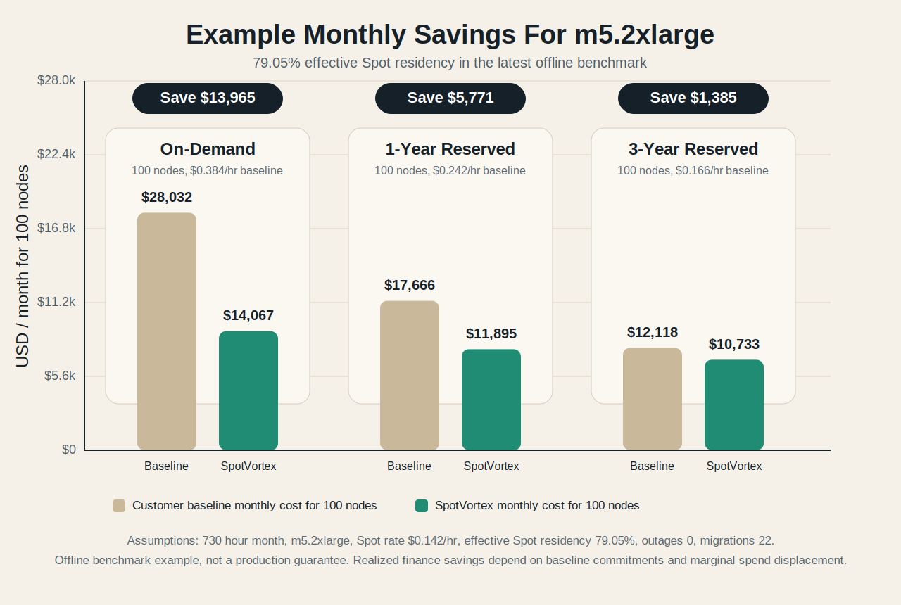

# SpotVortex Agent

[](LICENSE)
[](https://goreportcard.com/report/github.com/softcane/spot-vortex-agent)

SpotVortex Agent is the in-cluster controller for safe Spot adoption.

It helps SRE and FinOps teams move more Kubernetes capacity onto Spot without losing control of service risk. SpotVortex watches market risk and pool health, then adjusts Spot exposure at the node-pool level in a predictable way.



The chart above is a benchmark example based on the current shipped runtime posture: `10` minute control cadence, deterministic active policy, transition-aware TFT, and `max_spot_ratio=1.0`.

## What You Deploy Today

- Active policy mode: `deterministic`
- Control cadence: `10` minutes
- Spot bounds: `min_spot_ratio=0.167`, `max_spot_ratio=1.0`
- Preferred operating point: `target_spot_ratio=0.5`
- Market hazard model: transition-aware TFT from `models/tft.onnx`
- RL: shadow-only; it records comparison telemetry and does not actuate production changes
- Bundle contract: `models/MODEL_MANIFEST.json`
- Cloud scope: AWS, `60` supported instance families

The current AWS coverage is focused on common production pools: compute (`c5`, `c6`, `c7`), general purpose (`m5`, `m6`, `m7`), memory optimized (`r5`, `r6`, `r7`), and burstable (`t2`, `t3`, `t4g`), including Graviton and flex variants where available. The exact enforced scope lives in `models/MODEL_MANIFEST.json`.

The shipped runtime config lives in [config/runtime.json](config/runtime.json).

## How It Works

1. Watches Spot market risk for the instance families in scope.
2. Measures whether each node pool can safely absorb node loss.
3. Decides whether a pool should grow Spot, hold, freeze, or move back toward On-Demand.
4. Applies that decision with node-pool steering and controlled drain behavior.
5. Records RL recommendations in shadow mode for comparison only.

The control unit is the node pool, not the individual pod.

## Reference Economics: One `m5.2xlarge` Node Over One Month

This section turns the latest offline benchmark month for the `m5.2xlarge` slice into simple unit economics.

In that benchmark month, the shipped deterministic policy:

- kept effective Spot residency at `79.05%`
- recorded `0` outages
- migrated `22` times
- used the transition-aware TFT as the market hazard signal

That gives us a simple monthly cost model:

```text
monthly_system_cost = 730 * (spot_residency * spot_rate + (1 - spot_residency) * baseline_rate)
monthly_savings = 730 * spot_residency * (baseline_rate - spot_rate)
```

| Baseline | Baseline Rate | Spot Rate | Baseline Monthly Cost / Node | SpotVortex Monthly Cost / Node | Savings / Node / Month | Savings At 100 Nodes / Month |
|---|---:|---:|---:|---:|---:|---:|
| On-Demand | `$0.384/hr` | `$0.142/hr` | `$280.32` | `$140.67` | `$139.65` | `$13,964.74` |
| 1-Year Reserved | `$0.242/hr` | `$0.142/hr` | `$176.66` | `$118.95` | `$57.71` | `$5,770.55` |
| 3-Year Reserved | `$0.166/hr` | `$0.142/hr` | `$121.18` | `$107.33` | `$13.85` | `$1,384.93` |

These are gross compute-rate savings. Realized FinOps impact depends on your marginal baseline, commitment utilization, and whether the spend you move to Spot is actually displaced.


### Assumptions

- benchmark source: latest offline deterministic benchmark on the `m5.2xlarge` slice from the ML repo
- effective Spot residency: `79.05%`
- outages: `0`
- migrations: `22`
- month length: `730` hours
- Spot rate and baseline rates are illustrative example rates
- actual realized finance savings depend on whether commitment-covered spend is truly displaced

### How To Use This

- replace the example baseline with your real marginal cost
- use the benchmark table to size upside before rollout
- validate realized results from live telemetry once the controller is running in your cluster

Typical baselines:

- On-Demand
- Reserved or Savings Plan effective marginal rate
- internal chargeback rate

## How SpotVortex Judges Risk

SpotVortex does not treat every node pool the same. It asks a simple operational question: if this pool loses Spot capacity, how likely is that to create service pain or slow recovery?

To answer that, it keeps a pool-safety view for every node pool:

- `critical_service_spot_concentration`: how much of your critical workload is currently sitting on Spot.
- `min_pdb_slack_if_one_node_lost`: how much PDB room is left if the pool loses one node.
- `min_pdb_slack_if_two_nodes_lost`: how much PDB room is left if the pool loses two nodes in the worst placement.
- `stateful_pod_fraction`: how much of the pool is made up of harder-to-move stateful workloads.
- `restart_p95_seconds`: how long workloads in the pool usually take to come back healthy.
- `recovery_budget_violation_risk`: an overall risk score for whether a Spot loss is likely to break recovery expectations.
- `spare_od_headroom_nodes`: how much immediate On-Demand room is still available.
- `zone_diversification_score`: how well the pool is spread across availability zones.
- `evictable_pod_fraction`: how much of the pool can be safely moved right now.
- `safe_max_spot_ratio`: the Spot share the controller considers safe for that pool at this moment.

These signals are computed locally from pods, PDBs, node labels, startup latency, and current utilization:

- `critical_service_spot_concentration` = critical pods on Spot divided by total critical pods.
- `min_pdb_slack_if_one_node_lost` = the worst remaining PDB slack after removing the densest single-node placement.
- `min_pdb_slack_if_two_nodes_lost` = the worst remaining PDB slack after removing the two densest node placements.
- `stateful_pod_fraction` = StatefulSet workload pods divided by total workload pods.
- `restart_p95_seconds` = weighted P95 startup-to-ready time, with `spotvortex.io/startup-time` available as an override.
- `recovery_budget_violation_risk` = a heuristic roll-up of PDB tightness, critical concentration, stateful mix, restart time, On-Demand headroom, zone spread, and evictability.
- `spare_od_headroom_nodes` = estimated On-Demand nodes still available from current On-Demand capacity and pool utilization.
- `zone_diversification_score` = `0.0` in one zone, `0.5` in two zones, `1.0` in three or more zones.
- `evictable_pod_fraction` = workload pods that can currently be evicted voluntarily divided by total workload pods.
- `safe_max_spot_ratio` = the tightest Spot cap implied by the current safety signals.

This keeps decisions at the node-pool level while making the controller much more sensitive to real service impact.

If some pool-safety signals are unavailable, the runtime falls back to safe deterministic defaults instead of silently promoting RL behavior.

## How To Roll It Out

Treat SpotVortex as an operating control for capacity risk, not just a model bundle.

Recommended rollout path:

1. Install the agent in dry-run or shadow mode first.
2. Confirm the controller starts cleanly and sees your cluster the way you expect.
3. Compare its recommendations against the way your pools behave today.
4. Start with a small set of non-critical pools.
5. Watch interruption, restart, drain, recovery, and cost telemetry closely.
6. Expand only when the results are stable and the savings are real.

The runtime facts that matter for rollout are:

- the shipped controller is deterministic
- TFT is the live market risk input
- RL is shadow telemetry only
- bundle checksums are enforced through `models/MODEL_MANIFEST.json`
- production outcomes are confirmed with live telemetry

## Running Locally

```bash
helm upgrade --install spotvortex charts/spotvortex --namespace spotvortex --create-namespace
```

## Repository Layout

- [cmd/](cmd/): CLI entrypoints
- [config/](config/): shipped runtime config and install defaults
- [internal/config/](internal/config/): runtime config schema and normalization
- [internal/controller/](internal/controller/): deterministic controller and execution logic
- [internal/inference/](internal/inference/): ONNX bundle loading and inference contract
- [models/](models/): shipped model bundle and manifest
- [tests/e2e/](tests/e2e/): Kind and install-path helpers
- [hack/](hack/): release and install verification scripts

## Current Runtime Facts

- deterministic is the active runtime path
- TFT is the shipped market model
- RL is shadow-only
- `10` minutes is the active cadence
- manifest-verified bundle loading is required
- savings examples should be expressed against a clear baseline rate
