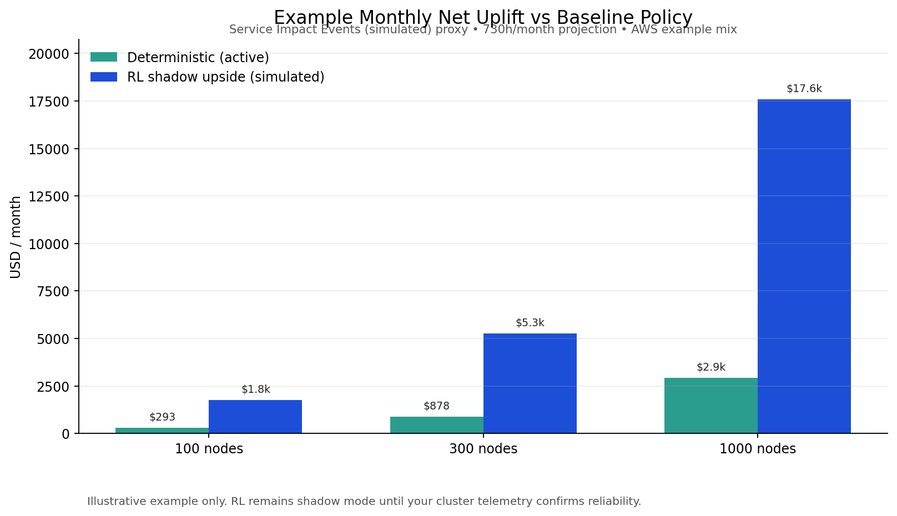

# SpotVortex Agent

SpotVortex is an open-source Kubernetes operator that helps teams use Spot capacity with safety controls.

It runs in-cluster, makes local decisions, and aims for one outcome:

- lower compute cost
- bounded risk
- auditable behavior

## Value At A Glance (Example)

These numbers are **incremental net uplift vs a baseline policy** in our current simulation setup.

- **Deterministic controller (active path today)**: safer default, production-first
- **RL policy**: higher upside in some runs, but **shadow mode first** until your cluster telemetry confirms reliability

### Example monthly uplift (illustrative)

| Cluster size | Baseline policy uplift | Deterministic (active) | RL shadow upside (simulated) |
|---|---:|---:|---:|
| 100 nodes | $0 | ~$293/mo | ~$1,758/mo |
| 300 nodes | $0 | ~$878/mo | ~$5,274/mo |
| 1000 nodes | $0 | ~$2,928/mo | ~$17,581/mo |

### What this RL shadow example means (simple)

- The RL shadow upside example above uses the **service-impact proxy** (`Service Impact Events (simulated)`).
- In that reference run (`RL seed42`), the projected upside came with **0 simulated service-impact events**.
- The same policy also showed about **40 Exposure Events** under the stricter legacy proxy (`any_spot_eviction`) in the evaluation sample.
- `730 hours/month` is only used to scale **money** into a monthly projection. It is **not** a claim of “40 events per month.”

### Example assumptions (important)

These example numbers are not universal. They depend on workload mix and market conditions.

- **Cloud**: AWS
- **Fleet node family mix (illustrative weighted average)**:
  - compute-optimized (`c5/c6/c7*`): ~35%
  - general-purpose (`m5/m6/m7*`): ~35%
  - memory-optimized (`r5/r6/r7*`): ~15%
  - burstable (`t3/t4g`): ~15%
- **Workload mix used in simulation priors**:
  - P0 critical: 6%
  - P1 sensitive: 12%
  - P2 standard: 47%
  - P3 elastic/batch: 35%
- **Metric used for value example**: `Service Impact Events (simulated)` (customer-impact proxy)
- **Cadence**: 30-minute decision steps
- **Period projection**: 730 hours/month

Best fit (highest value):
- clusters with high node-hours
- meaningful spot/on-demand price spread
- workloads with some elastic capacity (not all P0/P1)

## How SpotVortex Reduces Risk (Simple)

SpotVortex does not just “push more Spot.”

It adds safety controls around every decision:

- confidence/risk gating
- guarded draining and migration limits
- safe fallback behavior for unsupported conditions
- deterministic mode for production-safe rollout
- shadow mode for comparing RL recommendations before enabling them

## What “Risk” Means in Our Examples

We use clear labels so operators do not confuse proxy metrics with customer impact:

- **Exposure Events** = strict proxy (we were on Spot during a risky event label)
- **Service Impact Events (simulated)** = closer proxy for customer impact
- **Real interruption/recovery telemetry** = what matters most in production rollout

During rollout, you should judge success using **live telemetry**, not simulator metrics alone.

## Current Recommended Rollout Mode

- **Active controller**: deterministic
- **RL**: shadow mode (compare only, no actuation) until your telemetry confirms it is safe in your environment
